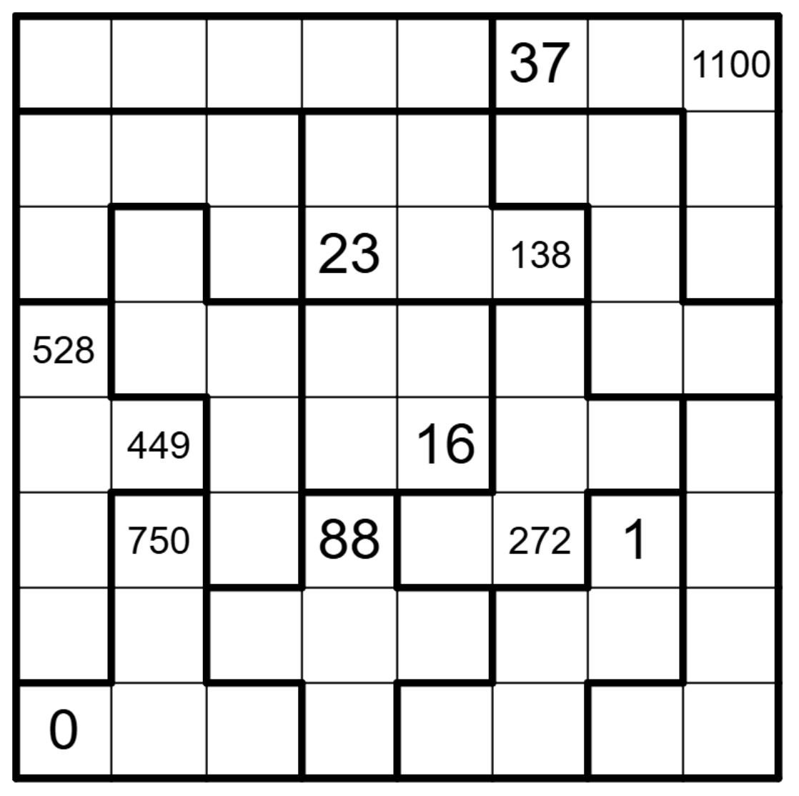

# Jane Street Puzzle - ‘Pent-Up’ Frustration 3 / Knight Moves 7

## The Puzzle Description & Rules

**Official Instructions from Jane Street:**

> The board above has been tiled with the 12 pentominoes (plus a 2-by-2 tetromino) into 13 regions. Think of each of these 13 regions as constructed out of 1-by-1-by-1 cubes. We need to add a tower to each region. A tower is an additional size-1 cube placed on one of a region’s squares.
> 
> After adding these towers, place a knight at the bottom-left square. It then proceeds to make knight’s moves until it has visited all the towers. It never visits the same space twice. (A move on this board involves travelling 0 units in one dimension, 1 in another, and 2 in the third. The knight is allowed to “pass through” towers as it moves.)
> 
> But there’s a catch: As you can see, the knight starts with a score of 0. On its Nth move, its score increases by N if the move is to a location at the same altitude as the square it moved from. If, instead, it moves up, the score is multiplied by N. And finally, if it moves down, the score is divided by N. This last type of move is only allowed if the score is evenly divisible by N.
> 
> Every three moves, up until move #18, the knight wrote down its score upon arriving at a given square. From then on it only wrote down its score every K moves, for some larger value K. Using this information, can you reconstruct the knight’s path?
> 
> After filling all the remaining visited squares with the missing score values, find the unvisited squares. For each of these squares, compute the sum of the scores in any orthogonally adjacent squares that were part of the knight’s path. The answer to this puzzle is the sum of these “neighbor sums” from the unvisited squares.

## How I Solved It

I started by solving the first 18 moves by hand, mapping out all possible score combinations and operations to pinpoint the starting rows based on the board's tokens. However, the branching factor quickly became too large—there were simply too many open paths to compute manually, and I realized it was impossible to do entirely by hand.

When I had to find the value of `K` (the interval for the scores after move 18), I wrote a Python script to help me out. This allowed me to lock down mandatory checkpoints and drastically narrow down my options.

I then built a Depth First Search algorithm to connect these checkpoints. 

But here was the biggest breakthrough: the numbers on the board only provide checkpoints up to move 53 (every 3 moves up to 18, and then every 7 moves up to 53). My initial runs failed because stopping at 53 made it mathematically impossible to visit all 13 towers. The crucial intuition was that the knight's journey **had to extend beyond move 53** but before 53+K.

By letting the algorithm push past the final token, it found the single, unique path that visits all 13 towers. The journey ends immediately upon landing on the 13th tower at move 54.

### Final Calculation

At the end of the journey, exactly 9 squares on the 8x8 grid remain unvisited by the knight:
`[(0, 7), (1, 5), (1, 7), (3, 0), (5, 0), (6, 3), (6, 4), (6, 7), (7, 1)]`

To compute the final answer, we sum the scores of all adjacent visited spaces for each unvisited square. The strict constraint forbids visiting any space twice, meaning each visited square contains exactly one score value.

The partial "neighbor sums" for these 9 unvisited squares are:
- (3, 0) -> Sum = 8392
- (5, 0) -> Sum = 7690
- (7, 1) -> Sum = 9925
- (6, 3) -> Sum = 1890
- (6, 4) -> Sum = 1646
- (1, 5) -> Sum = 2012
- (0, 7) -> Sum = 44
- (1, 7) -> Sum = 574
- (6, 7) -> Sum = 1436

Adding all these neighbor sums together yields the final definitive answer: **33609**.
